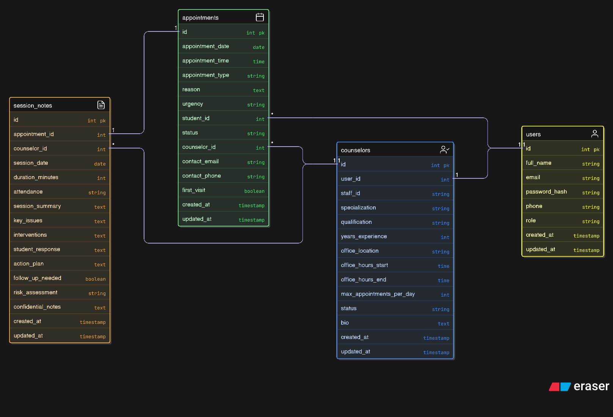

# Student Counseling Appointment System - README

## Git Hub repo: (https://github.com/aranamanj/csc548-StudentcounselingAppointmentSystem-group-AranAmanj-BawarHakim-RahozAhmed)

## Project Information
**Title:** Student Counseling Appointment System  
**Course:** CSC584 - Enterprise Programming
**Deliverable:** Deliverable 1 - Storyboard (JSP Flow) + Database ERD  
**Team:** Aran Amanj QIU23-0183 - Bawar Hakim QIU23-0451 - Rahoz Ahmed QIU23-0415

## Overview
A web-based system for managing student counseling appointments at a university. Students can book sessions, counselors manage schedules, and administrators oversee operations.

## Technology Stack
- **Frontend:** JSP, HTML5, CSS
- **Backend:** Java Servlets
- **Server:** Apache Tomcat
- **Database:** MySQL
- **IDE:** NetBeans

## File Structure

**Source Packages/**
- com.counseling.controller/
  - AuthFilter.java - Session authentication filter
  - LoginServlet.java - User authentication
  - LogoutServlet.java - Session termination
  - RegisterServlet.java - User registration with validation
  - DashboardServlet.java - Dashboard with real-time KPIs
  - appointments/
    - AppointmentListServlet.java - List all appointments
    - AppointmentCreateServlet.java - Create new appointment
    - AppointmentDetailsServlet.java - View appointment details
    - AppointmentEditServlet.java - Edit appointment
    - AppointmentDeleteServlet.java - Delete appointment

- com.counseling.dao/
  - UserDAO.java - User database operations
  - AppointmentDAO.java - Appointment CRUD operations
  - CounselorDAO.java - Counselor read operations

- com.counseling.model/
  - User.java - User entity JavaBean
  - Appointment.java - Appointment entity JavaBean
  - Counselor.java - Counselor entity JavaBean

- com.counseling.util/
  - DBConnection.java - JDBC connection manager

**Web Pages/**
- index.jsp - Main sitemap (updated with servlet URLs)
- META-INF/context.xml
- WEB-INF/web.xml - Servlet configuration
- WEB-INF/lib/mysql-connector-j-8.2.0.jar - JDBC driver

**appointments/**
- create.jsp - Book appointment (updated: servlet integration)
- details.jsp - View appointment (updated: dynamic data)
- edit.jsp - Edit appointment (updated: pre-populated form)
- list.jsp - All appointments (updated: database-driven table)

**assets/**
- styles.css - Main stylesheet

**auth/**
- login.jsp - User login (updated: LoginServlet integration)
- register.jsp - User registration (updated: RegisterServlet integration)

**counselors/**
- create.jsp - Add counselor (storyboard only)
- details.jsp - Counselor profile (storyboard only)
- edit.jsp - Edit counselor (storyboard only)
- list.jsp - All counselors (storyboard only)

**dashboard/**
- dashboard.jsp - Dashboard with KPIs (updated: real-time data from database)

**sessions/**
- create.jsp - Create session note (storyboard only)
- list.jsp - All session notes (storyboard only)

**students/**
- create.jsp - Add student (storyboard only)
- list.jsp - All students (storyboard only)

**database/**
- counseling_schema.sql - Complete database schema with sample data

**Libraries/**
- JDK 17+
- Apache Tomcat 10.1+ or TomEE 9+
- MySQL Connector/J 8.2.0
- Jakarta EE 10 Web API

**Configuration Files/**
- MANIFEST.MF
- context.xml
- web.xml

**Miscellaneous Files/**
- README.md
- ERD.png

## Key Features

### Authentication
- Login with role-based access (Student/Counselor/Admin)
- User registration with validation

### Dashboard
- KPIs: Total appointments, active students, available counselors, pending appointments
- Charts: Monthly trends, appointment types, counselor workload

### Appointments CRUD
- Book new appointments with counselor/date/time selection
- View all appointments with filters
- Edit appointment details and status
- Cancel appointments

### Counselors Management
- Add counselors with specializations (Academic, Mental Health, Career, Personal)
- View profiles and availability
- Edit counselor information

### Students Directory
- Register students
- Track appointment history

### Session Notes
- Confidential session documentation
- Attendance tracking and risk assessment

## Database Schema (4 Tables)

**1. users** (user_id PK)
- full_name, email, password_hash, phone, role

**2. counselors** (counselor_id PK, user_id FK)
- staff_id, specialization, qualification, office_location, status

**3. appointments** (appointment_id PK, student_id FK, counselor_id FK)
- appointment_date, appointment_time, type, reason, urgency, status

**4. session_notes** (session_id PK, appointment_id FK, counselor_id FK)
- session_date, duration, attendance, summary, risk_assessment

**Relationships:**
- users (1) → counselors (1)
- users (1) → appointments (M)
- counselors (1) → appointments (M)
- appointments (1) → session_notes (1)

## Form Input Types
text, email, tel, password, date, time, number, search, textarea, select, radio, checkbox, select multiple

## Navigation Flow
index.jsp → auth/login.jsp → dashboard.jsp → [appointments|counselors|students|sessions]/*.jsp

## Setup
1. Import project to NetBeans
2. Configure database in context.xml
3. Run schema.sql
4. Deploy to Tomcat
5. Access at http://localhost:8080/StudentCounselingAppointmentSystem/

## Status
✅ Completed: JSP pages, navigation, forms, CSS, ERD  
⏳ Next Phase: Servlets, database connectivity, CRUD operations

## Notes
- All JSP pages use: `<%@ page language="java" contentType="text/html; charset=UTF-8" pageEncoding="UTF-8"%>`
- Forms ready for servlet integration
- Responsive CSS with purple gradient theme (#667eea to #764ba2)
- Session duration: 60 minutes default
- Office hours: 9 AM - 5 PM, Mon-Fri